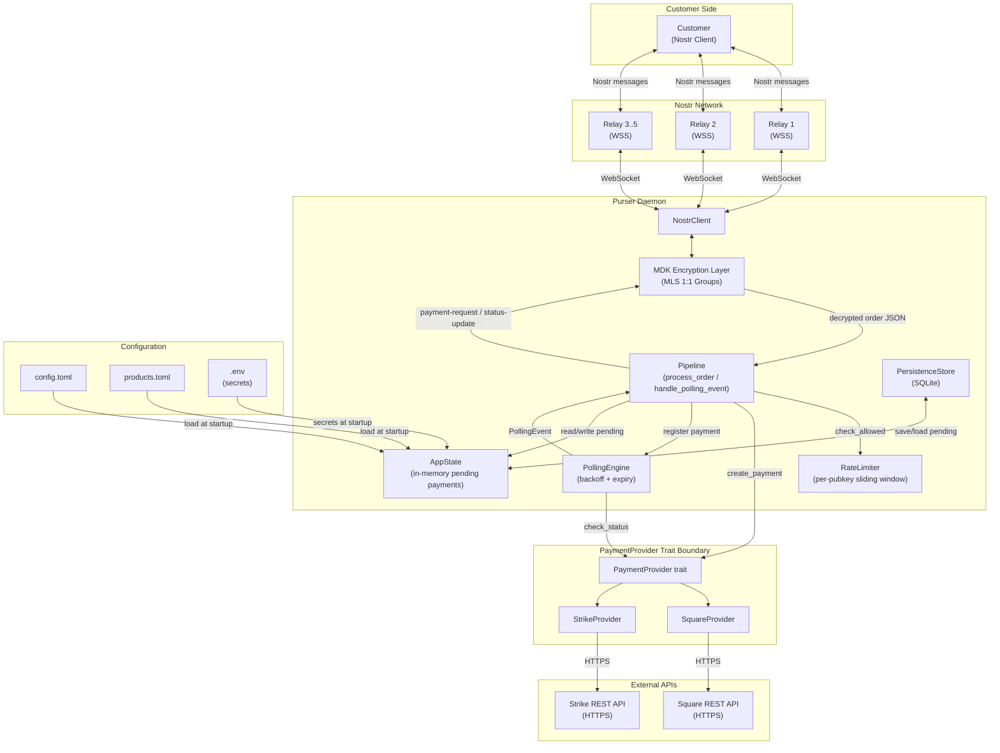
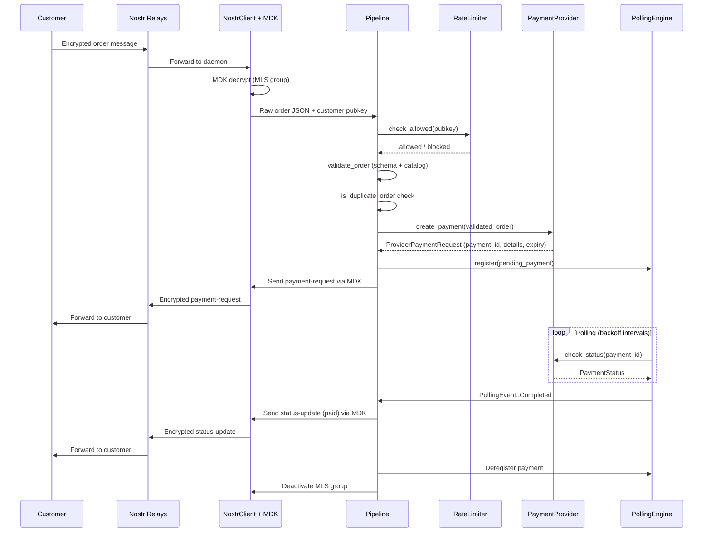

# Purser Architecture

## System Diagram

## Checkout Message Flow

## System Overview

Purser is a single-executable Rust daemon that replaces Zaprite with a sovereign, Nostr-native checkout system. It connects outbound to 2-5 Nostr relays via WebSocket and to payment provider APIs (Square, Strike) via HTTPS. There are no inbound network listeners -- the daemon communicates with customers exclusively through MLS-encrypted Nostr messages handled by the MDK library, and checks payment status through outbound polling only. Configuration is loaded from `config.toml` and `products.toml` at startup, with secrets (API keys, Nostr private key) injected via environment variables from a `.env` file.

## Module Responsibilities

### NostrClient and MDK

The `NostrClient` struct wraps the MDK library and manages all Nostr communication. It maintains WebSocket connections to configured relays and delegates encryption, decryption, key package management, and MLS group lifecycle to MDK. Every customer interaction (orders in, payment-requests out, status-updates out) passes through this layer, ensuring end-to-end encryption via MLS 1:1 groups. The client also handles key package rotation and stale group cleanup on configurable schedules.

### Pipeline

The pipeline module (`pipeline.rs`) is the central orchestrator, exposing two top-level async functions. `process_order` handles the inbound path: it decrypts an incoming order via the NostrClient, checks rate limits, validates the order against the schema and product catalog, routes it to the appropriate payment provider, registers the resulting payment for polling, and sends a `payment-request` back to the customer. `handle_polling_event` handles the outbound path: when the polling engine emits a terminal event (completed, expired, or failed), it builds a `status-update` message and sends it to the customer, then cleans up the pending payment and deactivates the MLS group.

### PollingEngine

The `PollingEngine` drives payment status checks for all pending payments. It maintains an internal map of `PendingPollEntry` records, each tracking its provider reference, current backoff interval, and last poll timestamp. The engine runs a continuous loop: for each entry whose interval has elapsed, it calls `check_status` on the appropriate provider. If the status is terminal (completed, expired, failed), it emits a `PollingEvent` on an mpsc channel consumed by the event handler in `main.rs`. Backoff intervals are configured per-provider via `PollConfig` (initial interval, multiplier, max interval). The engine does zero work when there are no pending payments.

### RateLimiter

The `RateLimiter` provides per-pubkey anti-spam protection using in-memory sliding windows. It enforces three rules: a maximum number of order attempts per hour, a failure threshold that triggers a temporary block, and a one-concurrent-session-per-pubkey limit. All state is held in `Mutex`-protected `HashMap` structures and resets on daemon restart -- a documented trade-off that favors simplicity and avoids persisting rate-limit state to disk.

### PersistenceStore

The `PersistenceStore` wraps a SQLite database with a single `pending_payments` table. Its purpose is crash recovery: on shutdown, all in-flight pending payments are serialized to JSON and saved; on startup, they are loaded back and re-registered with the polling engine (skipping any that have expired while the daemon was down). The store uses `rusqlite` directly with a simple key-value schema (`order_id TEXT PRIMARY KEY, data TEXT`).

### PaymentProviders

The `PaymentProvider` trait defines the boundary between the daemon core and external payment APIs. Each provider implements `create_payment`, `check_status`, `cancel_payment`, and `poll_config`. V1 ships with two implementations: `SquareProvider` (fiat/card payments via the Square Checkout API) and `StrikeProvider` (Bitcoin/Lightning payments via the Strike Invoices API). Providers communicate with external APIs over HTTPS using `reqwest`. The trait design allows adding new providers (e.g., BTCPay Server) by implementing the trait without modifying core daemon code.

## Polling Lifecycle

The polling engine follows a four-phase lifecycle per payment:

1. **Idle** -- No pending payments exist. The engine loop runs but performs no API calls, consuming negligible resources.
2. **Active** -- A payment is registered via `register()`. The engine begins polling at the provider's `initial_interval` (e.g., 3 seconds for Strike lightning invoices, 5 seconds for Square checkouts). Each poll calls `check_status` on the provider.
3. **Backoff** -- If a poll returns `Pending` (no status change), the interval is multiplied by the provider's `backoff_multiplier` (e.g., 1.5x), up to the provider's `max_interval` ceiling. This reduces API load for slow-paying customers while still detecting completion promptly.
4. **Completion / Expiry** -- When `check_status` returns `Completed`, `Failed`, or `Expired` (or the payment's `expires_at` timestamp is reached), the engine emits a `PollingEvent`, removes the entry from its internal map, and returns to idle (or continues polling other active payments).

The transition back to idle is immediate -- the engine never polls a terminal payment. Provider-specific rate limit strategies (`HeaderMonitor`, `FixedBudget`) can further throttle polling to stay within API quotas.
